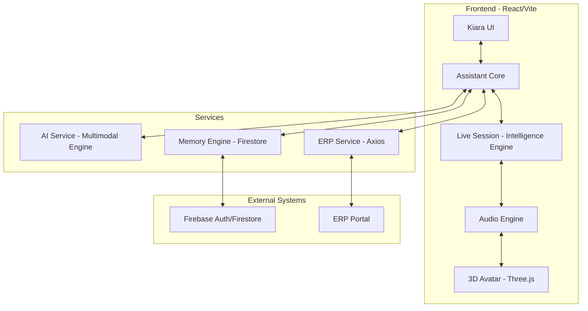

# Kiara: Unified System Architecture

## 1. System Overview
Kiara is a Personal Intelligence System designed with a modular, service-oriented architecture. It integrates real-time voice interaction, semantic memory, and ERP connectivity into a unified core.

## 2. Architecture Diagram

## 3. Module Definitions

### AssistantCore
The central orchestrator that manages the lifecycle of all modules.
- **audioEngine**: Handles PCM16 streaming and playback.
- **aiService**: Manages conversation analysis and idea generation.
- **memoryEngine**: Interfaces with Firestore for semantic storage.
- **erpConnector**: Bridges the system with the external project management portal.

### AI Service (Multimodal Engine)
- **analyzeConversation**: Extracts topic, intent, and action items.
- **generateIdeas**: Synthesizes stored memories into business opportunities.
- **searchMemory**: Performs semantic search using vector embeddings.

### ERP Service
- **createTask**: Pushes action items to the portal.
- **getTeam**: Fetches team member profiles and skillsets.
- **updateProject**: Syncs project status and metadata.

## 4. API Contracts

### ERP Integration
- **POST /tasks/create**
  - Payload: `{ title: string, description: string, priority: 'low'|'medium'|'high' }`
  - Auth: `Bearer <token>` + `X-API-Key`
- **GET /team**
  - Response: `Array<{ id: string, name: string, role: string, skills: string[] }>`
- **POST /projects/update**
  - Payload: `{ projectId: string, status: string, team: string[] }`

## 5. Integration Flow
1. **Trigger**: User starts recording a meeting.
2. **Capture**: Audio Engine streams PCM16 to Intelligence Engine.
3. **Analyze**: On session end, `AIService` processes the transcript.
4. **Memory**: Analysis is stored in Firestore with vector embeddings.
5. **Action**: `AssistantCore` identifies high-priority items and calls `ERPService.createTask`.
6. **Insight**: User requests ideas; `AIService` queries memory and generates opportunities.
7. **Sync**: 3D Avatar lip-syncs with audio output in real-time.
